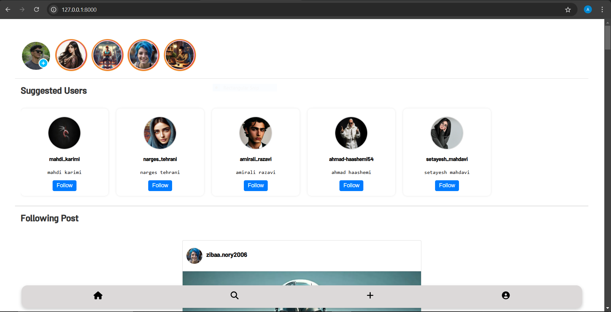
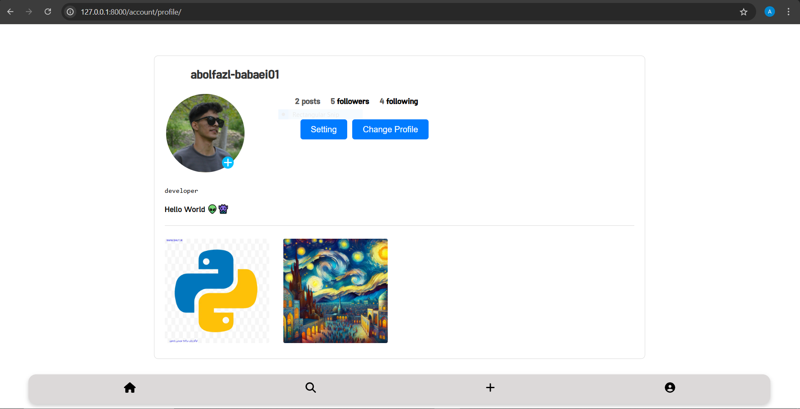
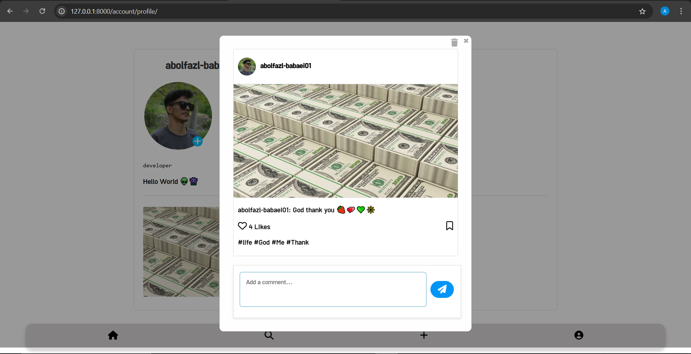

# Social Network Project

This is a **social network project** built with Django. The focus is primarily on backend development, with features designed to provide a seamless and interactive user experience. While the frontend is functional, it is not the main focus of this project. Feedback is welcome!

---

## 🌟 Main Features

- **Follow/Unfollow System** 📣  
  Users can follow or unfollow others to customize their feed.

- **Like and Save Posts** ❤️  
  Users can like posts or save them for later.

- **Create and Delete Posts** ✍️  
  Users can share their thoughts by creating posts and delete them if needed.

- **Load More Posts on Scroll** 📱⬇️  
  Infinite scrolling to load additional posts dynamically.

- **Stories (Photo/Video)** ⏳  
  Users can upload stories (images or videos) that auto-delete after 24 hours.

- **Story Views Tracking** 👀  
  Tracks story views based on user IP (one view per IP).

- **Comment System** 💬  
  Add comments to posts and engage with others.

- **Suggested Users Section** 🏠  
  Suggests new users to follow on the Home page.

- **Profile Settings and Account Deletion** 🛠  
  Users can update their profiles and delete their accounts.

---

## ⚡️ Technical Details

- **AJAX and JavaScript**  
  AJAX is used for a better user experience in:
  - Liking and saving posts.
  - Tracking story views.
  - Following and unfollowing users.
  - Loading more posts.
  - Adding comments.

---

## 🎨 About the Frontend

> The frontend is simple and functional but not polished.  
> My primary focus was on backend development, so please evaluate it with that in mind. 😊  
> I used everything I know about frontend development and sometimes even got help from ChatGPT! 😅  

---

## 📷 Project Screenshots

### Home Page

### Profile Page

### Post Detail

---

